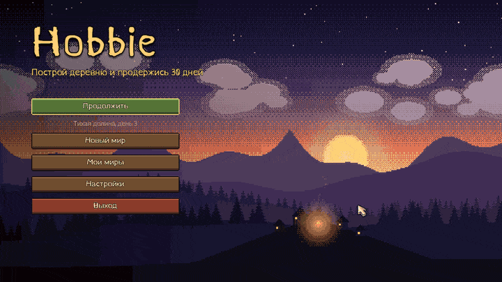

# Hobbie - мой игровой проект

[YOUTUBE](https://www.youtube.com/@fklska3995/shorts) канал по игре

## Updates
### Update 0.0.8 Survival 09.10.2026
Игра стала выживанием на 30 дней. Каждую ночь к деревне идёт волна мобов: гоблины, волки, скелеты-лучники и орки, а каждую пятую ночь приходит каменный гигант. Победа - дожить до рассвета 31-го дня, поражение - если разрушен центр поселения. Погибший герой возрождается у центра. С мобов падают монеты и артефакты, жителей можно вооружить, и ночью они охраняют деревню. Партия сохраняется на каждом рассвете и при выходе.

Появилась экономика поселения. Партия начинается с костра, который улучшается до деревянной ратуши, каменной ратуши и замка, каждый уровень открывает новые постройки. Ещё 9 типов зданий по 3 уровня: дома, фермы, склады, кузница, мастерская, рынок, казарма, стены и башни. Запасы ограничены складом, фермы каждое утро дают еду, а жители её съедают, на рынке можно торговать, монеты - основная валюта. В кузнице улучшаются инструменты и доспех героя и куётся оружие ближнего боя, в мастерской - дальнего.

Новая графика: герой, мобы, гигант, здания по уровням, ресурсы и предметы нарисованы своим генератором спрайтов на Python из простых объёмных фигур, в одном пиксельном стиле. Персонажи смотрят в 8 сторон. Появился звук: фоновая мелодия, джинглы победы и поражения и звуки действий, всё синтезировано скриптом, без чужих сэмплов.

Новый интерфейс: общая пиксельная тема, главное меню с анимированным фоном, экраны создания мира и списка миров, экран загрузки, пауза и настройки звука, видео и управления. Переделаны HUD, меню строительства и инвентарь. Генерация мира идёт в фоне и не подвешивает игру, экран загрузки ждёт, пока прогрузится земля вокруг героя. Исправлен белый фон у спрайтов на Vulkan.

[Видео со звуком (mp4)](docs/updates/0.0.8.mp4)

### Update 0.0.7 Game Loop 08.10.2026
Появился первый полноценный игровой цикл. Игрок добывает ресурсы, ставит ратушу и кузницу, нанимает жителей и выбирает, что им добывать. В кузнице можно выковать меч, который утраивает урон героя, а потом призвать босса - каменного гиганта. Победа - убить гиганта, поражение - если погиб герой или разрушена ратуша.

Жители и босс управляются через `AIController2D` из godot_rl_agents, без навмеша. Жители по умолчанию работают на модели `model_v9` из прошлого обновления (агент-сборщик), без модели переключаются на эвристику. Для дообучения жителей добавлена отдельная сцена. У босса модели пока нет, он работает на эвристике.

Переделана смена дня и ночи: время теперь считается в часах (полдень в 12:00), длину дня можно настроить. Облака, утренний туман и ночная цветокоррекция рисуются одним шейдером вместо старого compute шейдера. Ночью у героя горит фонарь, на зданиях загораются огни, летают светлячки.

Подготовка к релизу: миры сохраняются в `user://SavedWorlds/`, потому что в собранной игре `res://` только для чтения. Добавлен пресет экспорта под Windows и инструкция по сборке, ONNX модели теперь хранятся одним файлом, иначе в билде они не грузятся. Из проекта удалены неиспользуемые файлы и старые эксперименты, добавлен `AGENTS.md` с описанием структуры проекта.

### Update 0.0.6 RL Agents
Проведены первые успешные попытки обучения RL агента по исследованию карты и сбору ресурсов. Алгоритм - PPO, окружение ускорено в 4 раза. Планируется еще мультиагентное обучение, для вражеских мобов.

https://github.com/user-attachments/assets/894a089a-a91d-4b46-b8b0-1f0a3b295bd8

https://github.com/user-attachments/assets/f9e11a2a-92d0-46e3-9ec4-ccb425ac5d74

### Update 0.0.5 Optimization
Добавлена чанковая прогрузка карты, теперь вместо всей карты рендериться дистаниция в 3 чанка, также рендеринг карты разбивается на несколько кадров. Это значительно увеличило производительность, теперь на главной сцене больше фпс, а карта загружается намного быстрее из памяти. 

Однако генерация нового мира может стать узким местом, чтобы сгенерировать самую большую карту (384 на 384 тайла) уходит около минуты: 1 секунда на просчет данных и 59 секунд на сохранение ресурса Godot. На мальнький мир, например, на все провсе уходит 5 секунд. 

Пересмотрен подход к генерации ресурсов, было решено полностью отказаться от создания нодов в дереве сцены, в пользу тайловой карты. Из-за этого нужно пришлось отключить шейдеры для ресурсов, теперь недоступен `outline` шейдер и `покачивание` деревьев. В дальнейшем буду искать решения, для кастомизации отдельных тайлов на тайловой карте.

https://github.com/user-attachments/assets/3abaabfe-3e39-4c7f-b74a-febc8ff39fdc

### Update 0.0.4 New Procedural Generation and UI 15.07.2025
Полностью переписана процедурная генерация, теперь мир генерируется на основе нескольких шумовых карт - высотной, тепловой и карты влажности. Также изменена нормализация шума вместо `(value + 1) / 2` на `min-max normalization`. Добавлены новые биомы и текстуры, изменены настройки тайловой карты - теперь маштаб мира больше - размер 1 тайла увеличен с 16 до 64 пикселей. В дальнейшем генерация будет "тонко настраиваться". Добавлено UI меню генерации, сохранения и загрузки миров.

	
	
	
	

  
### Light update 0.0.3
Добалены тени и эффект облаков, динамическое освещение. Освещение и тени реализованы через гдрадиентную карту и шумы, освещение меняется в зависимости от "времени". "Время" считается через нормализованную функцию синуса `(sin(delta) + 1) / 2`, где 1 - это ясный полдень, а 0 темнаяа ночь

https://github.com/user-attachments/assets/0914b3fc-8088-47cf-a815-b2ee11b8582e

Напиши [мне](https://t.me/fklska) если хочешь поучаствовать

[Шрифт](https://ggbot.itch.io/kurland-font)

[Предпологаемая музыка](https://www.youtube.com/watch?v=Lj7ifGu00kc)

## Концепция

Основная идея - слияния концепций [Age of empires](https://ru.wikipedia.org/wiki/Age_of_Empires_II:_The_Age_of_Kings), [The Wither 3](https://ru.wikipedia.org/wiki/%D0%92%D0%B5%D0%B4%D1%8C%D0%BC%D0%B0%D0%BA_3:_%D0%94%D0%B8%D0%BA%D0%B0%D1%8F_%D0%9E%D1%85%D0%BE%D1%82%D0%B0)
и [Heroes of Might and Magic III](https://ru.wikipedia.org/wiki/Heroes_of_Might_and_Magic_III) 

А также других игровых [проектов ...](https://ru.wikipedia.org/wiki/Terraria)

### Это я к тому, что многие концептуальные вещи взяты из этих работ. 

К примеру, из эпохи империй и героев стратегический, и строительный аспекты. Система строительства, улучшения зданий, изучение технологий и т. д.
Из ведьмака система боевки и прокачки персонажа. Из террарии дизайн и проработка боссов. Они должны выглядить ярко, запоминаться, иметь какую-то мифологическую основу, как например, глаз Ктулху. 

К сожалению, я не дизайнер, и всю графику беру из открытых источников.

---
Игра задумавыется в стиле стратегии-рпг. Есть какая-то стратегическая цель развить свою деревню / город / поселение и защитить ее от монстров:

  
  
  

---

Есть РПГ аспекты: главный персонаж за которого играет игрок или несколько (планируется мультиплеер) прокачивает его, выбирает навыки, пути развития. А также жители (ИИ), который споособствует развитию и защите деревни / города / поселения:

  
  
  

Поведение ИИ основано на [NavMesh](https://docs.unity3d.com/Packages/com.unity.ai.navigation@2.0/manual/index.html) в частности на алгоритме [A*](https://ru.wikipedia.org/wiki/A*)

https://github.com/user-attachments/assets/365a39fe-342f-4798-b3c5-21504b11d2b0

---

## Генерация карты
Качество гифки пришлось сильно урезать

В игре присутствует процедурная генерация карты, основанная на [Шуме Перлина](https://ru.wikipedia.org/wiki/%D0%A8%D1%83%D0%BC%D0%9F%D0%B5%D1%80%D0%BB%D0%B8%D0%BD%D0%B0) , каждая целочисленная координата на карте имеет свою высоту (от 0f до 1f), все виды ресурсов распологаются на высоте до 0.35, чтобы оставались пустоты

### Генерация на Unity

  
  

### Генерация на Godot
При переносе игры на другой движок изменились некоторые тайлы, а в общем и целом все также

  
  
  

## Внутриигровой интерфейс

Праобраз - интерфейс из [Age of empires](https://ru.wikipedia.org/wiki/Age_of_Empires_II:_The_Age_of_Kings) или той же [Dota 2](https://ru.wikipedia.org/wiki/Dota_2), основанный на селекторе существ. Есть 1 основная плашка ,которая показывает всю необходимую информацию выбранного существа или объекта.

UPD: Скорее всего буду отказываться от этого. Основная плашка будет показывать только запасы ресурсов в деревне, а информация по инвентарю и характеристике только про главного персонажа.

  
  
  
  

Неболшое изменение UI в сторону упрощения. Всю информацию по деревне и жителям, а также строительство и ветки развития можно будет посмотреть в одном меню.

https://github.com/user-attachments/assets/6cabadb0-bbd5-403d-8143-88bbe25a1529

## Шейдеры и эффекты
Шейдеры и VFX пока что находятся на стадии изучения. На данный момент реализован outline шейдер, который добавляет внешнее выделение выбранного цвета и ширины, используется при наведении и в селекторе.

Также получилось реализовать что то более менее сностное - эффект сплеша от удара мечом. 

https://github.com/user-attachments/assets/f18a7eae-57c0-4e68-aefc-e7bc1b6d5c1f
